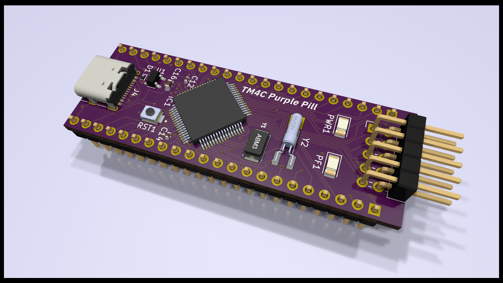

# TM4C-Purple-Pill

The schematic and PCB can be viewed without installing KiCad 8.0 by using [KiCanvas, an online KiCad viewer](https://github.com/theacodes/kicanvas)

https://kicanvas.org/?github=https%3A%2F%2Fgithub.com%2Frolo-g%2FTM4C-Purple-Pill
